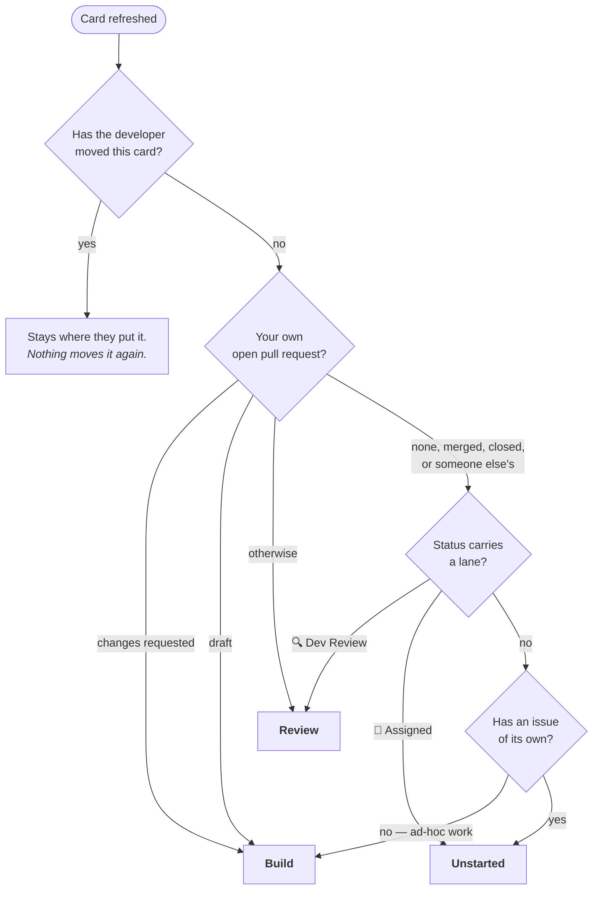
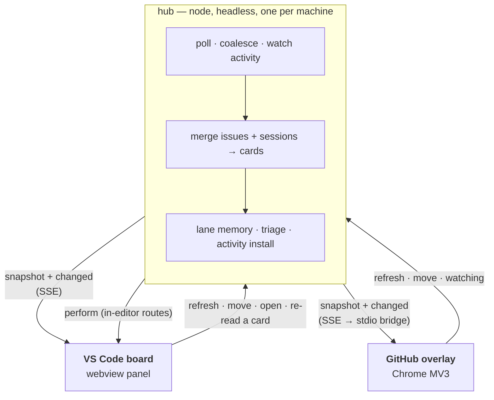
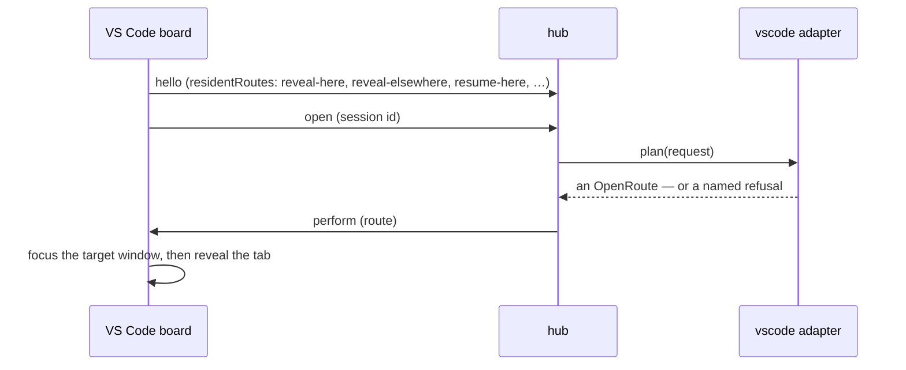
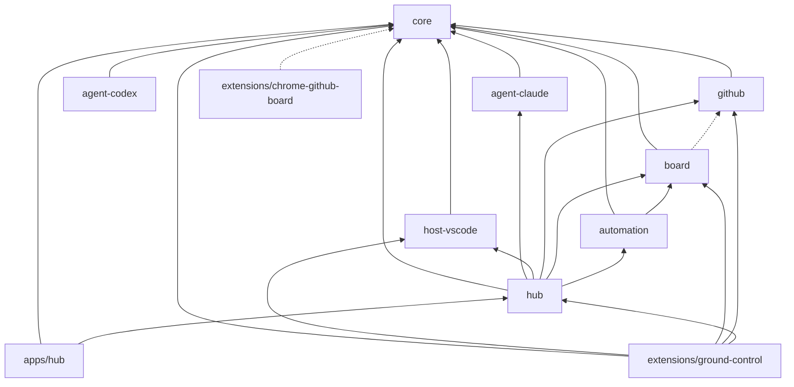

# Ground Control

One Kanban board for the GitHub issues assigned to you and the Claude Code sessions running on your machine.

Those live in three disconnected places: GitHub's project board, a fleet of VS Code windows across many worktrees, and terminal sessions whose state is only visible by attaching to them. Nothing shows what an agent is doing right now, and nothing shows which agent belongs to which issue. Ground Control puts both on one board — in a VS Code panel, and optionally painted onto GitHub's own project board in Chrome.

It is a personal board for one developer on one machine. Not a team dashboard, not a manager view. It writes nothing to GitHub of its own — the one thing that reaches a repository is a card action you turned on, which runs your own prompt in your own checkout.

## What it does

- **Issues and sessions on one surface.** One card per assigned issue. Every live agent session on the machine appears under the issue card its branch names, or on a card of its own per checkout when it belongs to no issue. No session is invisible.
- **Phase from evidence, never from claims.** A session's phase — working, waiting on you, ended its turn — comes from marker files a hook writes as the agent works, not from the agent's own report. A card the board cannot verify shows no phase rather than a guess.
- **Cards that need you are unmistakable.** *Needs you* (a permission prompt, a question, a plan to approve) and *your turn* (an agent that handed control back) are each carried on three channels at once — words, a border, and the session's own name — because colour alone is not enough.
- **Six lanes, the board's own.** A card arrives in the lane its evidence names; the moment you move it, your placement outranks the evidence. Placement is one record per machine, so a card moved on one board sits in that lane on every board.
- **Work that leaves your hands leaves the board,** into an Archived column with a count, and forgets its placement — a card that comes back arrives on fresh evidence, marked as returned.
- **Go to a session.** A card's session row reveals that session's tab in the window running it, and an issue card with nothing live offers its most recent saved session to resume. From the overlay the same row is a `vscode://` link, so the browser hands VS Code the foreground rather than taking it.
- **Card triage.** A card can say what it is waiting on and where it stands, read from its issue and pull request text. This is the one thing the board itself sends anywhere, and it is a setting you turn off.
- **Card actions.** Where a card is asking for the base branch merged into yours, the board offers to do it: your prompt, in that card's own checkout, as a session you can watch, take over and stop. It never decides a merge is due on its own — somebody has to have asked, or you press the control. It ships off, with no prompt, and it refuses a branch stacked on anything but the default branch rather than guessing at a chain of merges.

### Lanes

Every lane names one action the card is asking for.

| Lane | The action it asks for |
| --- | --- |
| **Unstarted** | pick it up, or leave it |
| **Plan** | agree what to build |
| **Build** | nothing, unless it stopped |
| **Review** | read a diff and judge it, or answer a review of your own |
| **Done** | confirm and let go |
| **Icebox** | nothing, deliberately |

A card arrives on its own evidence, re-read on every refresh for as long as you have not moved it. First match wins:



The pull request outranks the status because a review asking for changes is code to change whatever the tracker says. Which statuses carry a lane is a setting, shipped with the two that do. There is no Blocked lane, because nothing that would sit in it belongs together: a session stopped by a usage limit recovers on its own, a failed read is already a notice, and "I am avoiding this" is the Icebox.

## Getting started

Node >= 20, VS Code, the [`gh` CLI](https://cli.github.com) authenticated (`gh auth status`), and Claude Code on your `PATH`.

```bash
npm install
npm run build
cd extensions/ground-control && npm run package
code --install-extension ground-control-*.vsix
```

Run **Ground Control: Open Board** from the command palette. Team-wide facts ship as defaults — the project number, which statuses keep a card on the board and which carry a lane. Two settings name you and your work, so neither is guessed: `groundControl.github.repo` is the repository work is tracked in, and the board reads nothing until it is set. Leave `groundControl.github.logins` empty and the board asks for your GitHub logins in place, since every query it makes is `assignee:` and picking one for you would put somebody else's issues on your board.

Opening the board is also what starts the hub and installs the activity hooks into your Claude Code settings. A developer who never opens it has nothing running and nothing written to `~/.claude`.

**When something looks wrong,** press **Logs** on the board. That reveals what the background process is doing, streamed as it happens, and stops reading it again when you press it again — until you ask, nothing about that file crosses to the board. **Ground Control: Toggle Hub Log** does the same from the palette, which is how you turn it off after closing the board that turned it on; **Ground Control: Show Board Log** opens the window's own half, which is written whether or not anybody is looking. The browser overlay carries the same pair in a sidebar, from **Show log** in its own menu.

**The browser overlay** is loaded by hand — it is not on the Chrome Web Store. Run **Ground Control: Enable GitHub Overlay**, which writes the native-messaging manifest and, on Windows, the `HKCU` key Chrome finds it by. Then load `extensions/chrome-github-board` at `chrome://extensions` with Developer mode on. **Ground Control: Disable GitHub Overlay** reverses the registration, and uninstalling the extension does too.

## Architecture

One headless **hub** owns everything a board needs to render and act. Boards are clients: they render its snapshot and forward your actions, and they decide nothing.



**Why a separate process.** Two of the things the hub holds cannot be held twice: lane placement is one record — a card in Build on one board is in Build on every board — and hook installation is one act, since two processes syncing `~/.claude/settings.json` is a race. A Chrome extension also forces the hub out of VS Code: it cannot spawn `claude` or `gh`, read `~/.claude`, or watch a directory. Hosting the hub inside a window would tie the browser board's lifetime to whichever window happened to host it, and force an election among open windows on every launch.

The hub owns no work item's state. It reads what the sources report and what you placed; it never decides that a piece of work is done.

### The three seams

Every external thing the hub touches sits behind one of three interfaces, each backed by a registry in `packages/hub`. Everything the hub reads comes through one of those three and only those three, so adding a target is a registry entry and a configuration id — the loop, the merge, the lane memory, and every client stay unchanged.

| Seam | Answers | Today |
| --- | --- | --- |
| **Agent adapter** | Which sessions are alive, what each is doing, what each is called, and — optionally — one bounded question answered as JSON, or one piece of work started in a checkout | `claude` |
| **Host adapter** | Where a session is showing, how to reveal it, how to release it | `vscode` |
| **Work source** | Which items are on the board, and each one's status | `github` |

A host adapter has a headless half and, where needed, a **resident** half — code that has to run inside the application itself. A `vscode://` URI follows whichever window has focus, and a miss starts a fresh agent in the wrong window. A headless process cannot tell which window has focus; an extension can. So the `vscode` adapter lists those routes as `residentRoutes`, the editor client offers to perform them when it connects, and the hub hands them over. Every VS Code route is resident today, which is why that adapter offers no headless `open` at all rather than one that performs nothing.



### The loop

- **Two cadences.** Work sources are a network round trip and poll on the long interval; agent adapters spawn a CLI and poll on the short one. Each keeps its last good read and its last failure, so one failing never blanks another.
- **Activity is event-driven.** The hub watches each activity signal's directory, batching changes for 150 ms. A marker change on a listed session costs one file read; a marker for an unlisted session means the roster moved, and only the CLI can settle that. A permission prompt reaches both boards one file event and one batch window after the hook fires.
- **A floor per cost.** A read already in flight absorbs any timer or button press that lands while it runs. Otherwise each read has a minimum interval set by what it costs: a second for a CLI spawn, a minute for a GitHub round trip. Boards report themselves watching on every tab switch, so without those floors an editor in use would hammer both.
- **Idle when unwatched.** Clients report whether they are looking. With none watching, polling stops and activity events cost nothing. The hub exits after 30 minutes at zero clients, and the next board open starts it again in about a second.

### Transport

The hub serves HTTP on `127.0.0.1` on an ephemeral port: the snapshot and actions as requests, changes as Server-Sent Events. A client reads the port and token from `~/.claude/ground-control/hub.json`, then proves the listener is a hub for the same home on the same protocol before sending the token — the proof never puts the token on the wire.

A web page can reach loopback, and the `configure` action carries executable paths, so the server accepts nothing a browser is capable of sending: it refuses any request carrying an `Origin` header, any `Host` that is not its own loopback address, a non-JSON or oversized body, and more than eight streams. Chrome reaches the hub by native messaging instead — the hub bundle running in a second mode — which relays three messages, `refresh`, `watching`, and a `move` to a lane the board has, and refuses everything else by name.

The snapshot and the actions are one typed contract in `packages/core`, carrying an integer protocol version. A field renamed in the hub fails the typecheck in every client rather than rendering an empty board.

Route by route, in [docs/architecture.md](docs/architecture.md).

## Packages



Dashed edges are type-only, erased at build.

| Package | Holds |
| --- | --- |
| `packages/core` | The seams, the neutral `Session`, the lane and card types, the client protocol, shared helpers. Names no adapter |
| `packages/agent-claude` | The `claude` adapter: `claude agents --json`, transcript titles, the hook writer, the marker reader |
| `packages/agent-codex` | The `codex` adapter: the hook writer, the markers that are its roster, the rollout history reader |
| `packages/host-vscode` | The `vscode` adapter's headless half: lock files, window stores, the placement table, the open plan, the changes fold |
| `packages/github` | The `github` work source: assigned issues through the `gh` CLI |
| `packages/board` | Merge and lane rules, and what a card is asking for |
| `packages/automation` | Which cards the board may act on, what a run is authorised against, and what it remembers having run |
| `packages/hub` | Registries and defaults, the loop, lane memory, activity install, the watcher, the server, and the client transport |
| `apps/hub` | The daemon entry point and the Chrome bridge; `ground-control-hub` |
| `extensions/ground-control` | The VS Code client and the `vscode` resident half; bundles the hub as `dist/hub.js`. Reaches `board` and `github` for the two settings readers, which stay in the client because what they read is VS Code's own settings |
| `extensions/chrome-github-board` | The Chrome client: MV3 worker, content script, overlay DOM layer. No build step — Chrome loads the directory as it stands |

**Nothing outside `extensions/ground-control` may import `vscode`.** That boundary is what makes the logic testable in vitest — a module importing `vscode` can only be verified by hand, so decisions live in a `packages/*` module and the extension stays thin. One package per adapter is what makes the seams enforceable: `agent-claude` cannot reach `agent-codex` or `host-vscode`, and each carries its own coverage floor.

## Tech stack

TypeScript 5.9 strict (`noUncheckedIndexedAccess`, `exactOptionalPropertyTypes`), ES2022, `nodenext` modules, project references (`tsc -b`). npm workspaces on Node >= 20. vitest with per-package coverage floors, zod on every external payload, esbuild for the extension bundle, `@vscode/vsce` for packaging.

## Working on it

```bash
npm run verify            # build + typecheck + test with coverage thresholds — the gate the pre-commit hook runs
npm run verify:full       # the gate plus the integration tests, in a real VS Code
npm run test:integration  # builds, then runs the extension in a real VS Code window
npm run build             # tsc -b across packages, esbuild for the extension
npm run watch             # incremental build while iterating
npm run hub               # run the hub in the foreground, after a build
```

`npm run verify` is the only definition of "the tree is good" — not a window that looked right, not a screenshot. No test touches the network: fixtures live in `packages/*/test/fixtures/`, recorded from real responses and trimmed only by deleting whole nodes.

The integration run launches a VS Code of its own against a temporary home, so it never touches the board you are using.

`~/.claude/ground-control/` holds `hub.json` (port and token), `config.json` (the settings the hub last accepted from a client), `lanes.json`, `triage.json`, and `hub.log`. `node apps/hub/dist/main.js --stop` stops a running hub — on Windows there is no signal that will — and `--home=<path>` points one at a home of its own.

The extension does not run the repo's copy of the hub: it writes the hub it carries to `~/.claude/ground-control/hub.js` on activation and starts that. A hub whose record predates the bundle on disk is stopped and replaced, so `npm run build` plus a window reload puts a rebuilt hub in front of a board.

## Privacy

**Board state and interaction are local. Classification is not.** Everything the board reads, remembers, and renders stays on this machine, and nothing about your work is sent anywhere as a consequence of looking at a board.

Card triage is the exception, and it is one you turn off in a setting. Reading a card sends its issue and pull request text to the model, through the agent CLI: titles, bodies, and recent comments, other people's included, with each commenter's name as their GitHub profile gives it, how each relates to the repository, who was asked to review and what each review said, and who moved the card between which statuses, assigned or unassigned whom, and when.

## Docs

Source-of-truth planning docs live in [docs/](docs/). Read the relevant one before making decisions it covers; they are updated in the same commit as the work that changed them, reworked in place rather than appended to.

| Document | Covers |
| --- | --- |
| [docs/prd.md](docs/prd.md) | User-facing requirements (R-numbers), scope, audience |
| [docs/architecture.md](docs/architecture.md) | How the pieces fit — the hub, the seams, the protocol, package boundaries |
| [docs/mechanics.md](docs/mechanics.md) | Verified mechanisms — CLI flags, session files, extension APIs, with the date each was measured |
| [docs/testing.md](docs/testing.md) | The gate every commit passes, what earns a test, fixture rules |

[AGENTS.md](AGENTS.md) carries the working agreement for agents and contributors.
